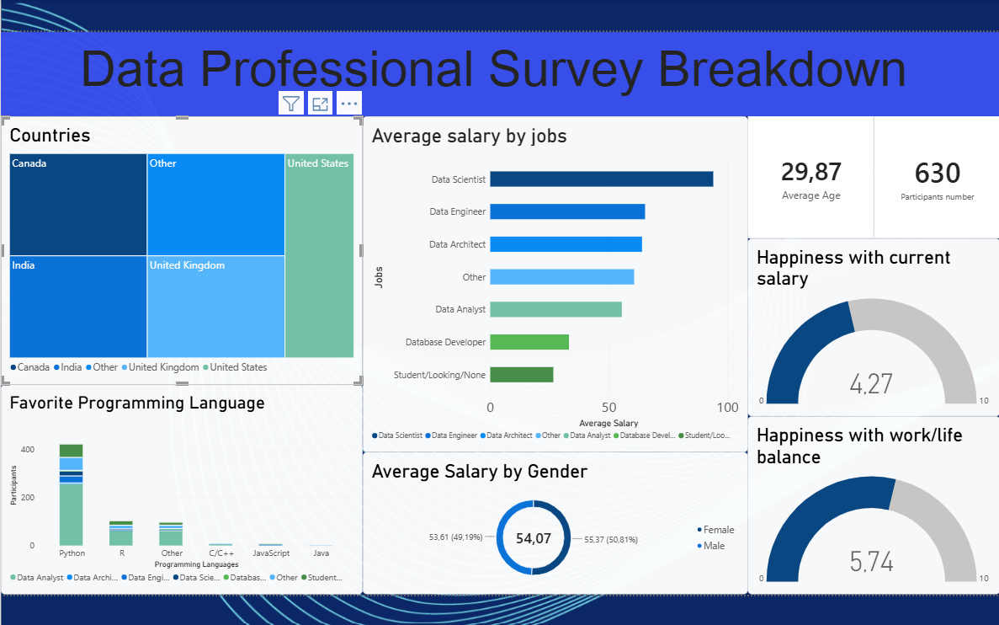

# Data Professional Survey Dashboard

A Power BI dashboard analyzing survey responses from 630 data professionals, covering salary, job satisfaction, career background, and demographics.

## Dataset

- **Source:** Data Professional Survey (630 responses)
- **Format:** Excel (`.xlsx`)
- **Fields include:** job title, career-switch history, salary range, industry, favorite programming language, happiness ratings (salary, work/life balance, coworkers, management, upward mobility, learning), difficulty breaking into data, job search priorities, gender, age, country, education level, ethnicity

## Dashboard

**What it shows:**
- Participant breakdown by country and favorite programming language
- Average salary by job title and by gender
- Average age and total participant count
- Happiness with current salary and work/life balance (rated out of 10)

## Tools & Skills

- Power BI: DAX measures, treemaps, gauges, filters/slicers
- Data visualization: dashboard layout, theming, chart selection

## How to use

1. Open `dashboard.pbix` in Power BI Desktop.
2. Use the Country filters on the right panel to slice the data.
3. Hover over any chart for exact values.
