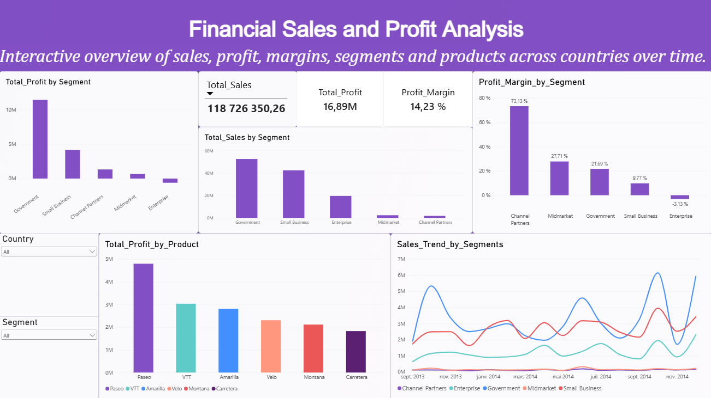

# Financial Sales & Profit Analysis Dashboard

A Power BI dashboard analyzing sales and profitability across segments, products, and countries, using 700 sales transactions from September 2013 to December 2014.

## Dataset

- **Source:** Financial Sample dataset (Microsoft's public sample data)
- **Format:** Excel (`.xlsx`)
- **Fields include:** segment, country, product, discount band, units sold, manufacturing price, sale price, gross sales, discounts, sales, COGS, profit, date

## Dashboard

**What it shows:**
- Total sales, profit, and profit margin at a glance ($118.7M sales, $16.9M profit, 14.2% margin)
- Profit and profit margin by segment
- Profit by product
- Sales trend by segment over a 16-month period
- Country and segment filters that slice every visual on the page

**Key insight:** Channel Partners has the smallest sales volume of any segment but by far the highest profit margin (73%). Enterprise, despite meaningful sales, is actually unprofitable on a margin basis (-3.1%) — a pattern that's invisible in the top-line sales number alone.

## Tools & Skills

- Power BI: DAX measures, card visuals, trend lines, filters/slicers
- Data visualization: dashboard layout, theming, chart selection

## How to use

1. Open `Financial-Sales-Profit-Dashboard.pbix` in Power BI Desktop.
2. Use the Country and Segment filters on the left panel to slice the data.
3. Hover over any chart for exact values.
